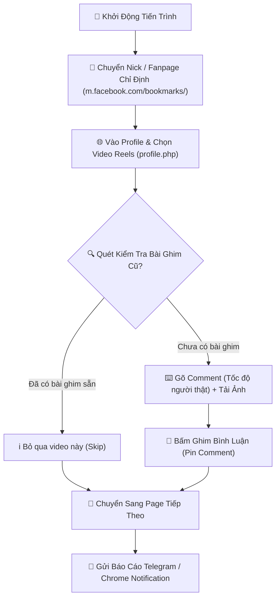

# 🤖 AutoPinBot Mobile Simulator (Bản Web Chrome)

> **Hệ thống tự động hóa chuyển Nick Facebook Mobile, kiểm tra & ghim bình luận (Pin Comment) tự động 100% cho tất cả các Fanpage chỉ định chưa có bài ghim.**

---

## 📌 1. Mục Đích Chính Của Dự Án

Mục đích cốt lõi của hệ thống **AutoPinBot Mobile Simulator** là **tự động kiểm tra, gõ bình luận mẫu kèm ảnh và ghim bình luận (Pin Comment) lên tất cả các Fanpage / Nick Facebook được chỉ định mà CHƯA CÓ BÌNH LUẬN GHIM**.

Hệ thống giúp các chủ shop quần áo, thời trang, đồ bộ, gia dụng:

1. **Tự Động Quét & Chỉ Ghim Bài Chưa Có Comment**: Nhận diện thông minh các bài viết/video Reels đã có bình luận ghim sẵn ➔ Tự động **bỏ qua (Skip)** để tránh bình luận trùng lặp; chỉ thực hiện gõ text, đăng ảnh và ghim bài đối với các bài/Fanpage **chưa có bài ghim**.
2. **Tiết Kiệm 95% Thời Gian & Công Sức**: Tự động chuyển đổi qua lại hàng chục Fanpage/Nick Facebook chỉ trong vài giây mà không cần thao tác tay thủ công.
3. **Phủ Sóng Bán Hàng Tối Đa**: Tự động ghim bình luận mẫu (chứa link Shopee, Zalo, bảng giá, mẫu đồ bộ) lên đầu phần bình luận của tất cả các Video Reels trên các Fanpage chỉ định.
4. **Đảm Bảo An Toàn & Chống Khóa Tính Năng (Anti-Ban)**: Giả lập giao diện di động iPhone 12 Pro, áp dụng độ trễ gõ phím ngẫu nhiên người thật và hỗ trợ xoay IP Proxy an toàn.
5. **Báo Cáo & Giám Sát Realtime**: Gửi báo cáo chi tiết qua Telegram, thông báo Chrome Desktop và hỗ trợ nút **1-Click Copy Báo Cáo Zalo**.

---

## 🛠️ 2. Nguyên Lý & Cách Thức Hoạt Động

Dự án hoạt động dưới dạng một **Chrome Extension Manifest V3**, điều hướng trực tiếp trên giao diện di động `m.facebook.com` theo chuỗi quy trình tự động 6 bước:

### 🔍 Chi Tiết Các Bước Thao Tác:

1. **Đổi Nick Tự Động (`account_switcher.js`)**:
   - Truy cập giao diện Menu tài khoản `m.facebook.com/bookmarks/`.
   - Tìm kiếm phần tử chứa Tên Nick / Fanpage cần chạy và thực hiện đổi Nick mượt mà.
2. **Duyệt Trang Profile & Chọn Reels (`auto_pin.js`)**:
   - Mở trang `m.facebook.com/profile.php` của Nick vừa đổi.
   - Tìm kiếm bài đăng Video Reels mới nhất để xử lý.
3. **Bộ Quét Nhận Diện Bài Đã Ghim Thông Minh (`auto_pin.js`)**:
   - Quét toàn bộ nội dung bình luận đã có trên video.
   - Kiểm tra trùng khớp theo Tên Nick, Nội dung mẫu, Link Shopee/Website hoặc ký tự đặc biệt (OBJ).
   - Nếu đã có bài ghim sẵn ➔ Tự động bỏ qua để không bình luận đè trùng lặp.
4. **Giả Lập Thao Tác Gõ Phím & Đăng Ảnh (`auto_pin.js`)**:
   - Áp dụng độ trễ ngẫu nhiên `30ms – 120ms` cho từng ký tự, có khoảng dừng nghỉ ở dấu câu `. , ! ?`.
   - Nạp ảnh sản phẩm từ bộ nhớ tạm và bấm nút **Đăng / Send**.
5. **Ghim Bình Luận Đa Lớp (Pin Comment)**:
   - Tìm nút 3 chấm menu trên đoạn bình luận vừa đăng.
   - Kích hoạt menu ngữ cảnh và bấm nút **"Ghim bình luận" / "Pin comment"**.
6. **Điều Phối Lịch Chạy & Báo Cáo (`background.js`)**:
   - Quản lý luồng chạy, xử lý danh sách Nick bị lag (xếp hàng thử lại ở vòng sau).
   - Phát âm thanh & thông báo Chrome Desktop.
   - Gửi báo cáo chốt sổ tổng kết lên Telegram và tạo báo cáo 1-Click Copy Zalo.

---

## ⏰ 3. Các Chế Độ Chạy & Lập Lịch Giờ Vàng

- **🛑 Chạy 1 Lần Rồi Dừng**: Chạy hết danh sách Page trong danh sách rồi tự động ngắt tiến trình và chốt báo cáo.
- **♾️ Chạy Liên Tục**: Đã duyệt xong 1 vòng tất cả các Page ➔ Nghỉ 45 giây rồi xáo trộn ngẫu nhiên thứ tự Nick chạy vòng mới.
- **⏳ Chạy Cách Khoảng**: Nghỉ ngẫu nhiên X phút (VD: 20 – 40 phút) giữa các vòng chạy.
- **⏰ Hẹn Giờ Chạy (Giờ Vàng)**: 
  - Tích hợp **Bảng Đếm Ngược Realtime (Giờ - Phút - Giây)**.
  - Tích hợp bộ quét 2 giây/lần trong Service Worker đảm bảo tự động bật tab chạy **đúng chính xác từng giây** khi tới Giờ Vàng (VD: `08:20, 12:00, 20:00`).
  - Hỗ trợ **Lập Lịch Theo Ngày Trong Tuần (Weekly Scheduler)**: Tích chọn các ngày cụ thể trong tuần (T2 ➔ CN).

---

## 🛡️ 4. Tính Năng Chống Khóa & An Toàn

- **📱 User-Agent Mobile**: Đổi thông số User-Agent và kích thước màn hình chuẩn iPhone 12 Pro (`390x844px`).
- **🌐 Tích Hợp Proxy IP**: Hỗ trợ nạp Proxy riêng (Host, Port, User, Pass) để thay đổi IP mạng ảo cho từng phiên.
- **🛡️ Tự Động Xử Lý Lag/Vòng Xoay Spinner**: Nếu Facebook kẹt spinner loading, bot tự xếp Nick đó vào danh sách chờ thử lại cuối phiên mà không làm kẹt luồng chính.

---

## 📁 5. Cấu Trúc Mã Nguồn (Project Structure)

| File | Vai Trò & Chức Năng Chính |
| :--- | :--- |
| [manifest.json](file:///C:/Users/PC/Downloads/ghimbinhluan%20t%E1%BB%B1%20%C4%91ong%202%20b%E1%BA%A3n/Ban_Web_Chrome/manifest.json) | File cấu hình Extension Manifest V3 (Khai báo permissions, background worker, ruleset) |
| [background.js](file:///C:/Users/PC/Downloads/ghimbinhluan%20t%E1%BB%B1%20%C4%91ong%202%20b%E1%BA%A3n/Ban_Web_Chrome/background.js) | Service Worker trung tâm: Điều phối luồng chạy, xử lý alarm hẹn giờ, gửi báo cáo Telegram, phát thông báo Chrome |
| [account_switcher.js](file:///C:/Users/PC/Downloads/ghimbinhluan%20t%E1%BB%B1%20%C4%91ong%202%20b%E1%BA%A3n/Ban_Web_Chrome/account_switcher.js) | Content Script thực thi đổi Nick trên trang `m.facebook.com/bookmarks/` |
| [auto_pin.js](file:///C:/Users/PC/Downloads/ghimbinhluan%20t%E1%BB%B1%20%C4%91ong%202%20b%E1%BA%A3n/Ban_Web_Chrome/auto_pin.js) | Content Script chính: Quét bài ghim cũ, gõ comment, tải ảnh & bấm ghim bình luận |
| [popup.html](file:///C:/Users/PC/Downloads/ghimbinhluan%20t%E1%BB%B1%20%C4%91ong%202%20b%E1%BA%A3n/Ban_Web_Chrome/popup.html) & [popup.js](file:///C:/Users/PC/Downloads/ghimbinhluan%20t%E1%BB%B1%20%C4%91ong%202%20b%E1%BA%A3n/Ban_Web_Chrome/popup.js) | Giao diện điều khiển nhanh khi bấm icon Extension |
| [dashboard.html](file:///C:/Users/PC/Downloads/ghimbinhluan%20t%E1%BB%B1%20%C4%91ong%202%20b%E1%BA%A3n/Ban_Web_Chrome/dashboard.html) & [dashboard.js](file:///C:/Users/PC/Downloads/ghimbinhluan%20t%E1%BB%B1%20%C4%91ong%202%20b%E1%BA%A3n/Ban_Web_Chrome/dashboard.js) | Giao diện quản trị toàn màn hình (Dashboard Pro V4) |

---

## 🚀 6. Hướng Dẫn Cài Đặt & Sử Dụng

1. Tải toàn bộ thư mục mã nguồn về máy.
2. Mở trình duyệt Google Chrome ➔ Truy cập đường dẫn `chrome://extensions`.
3. Bật công tắc **Chế độ dành cho nhà phát triển (Developer mode)** ở góc trên bên phải.
4. Bấm nút **Tải tiện ích đã giải nén (Load unpacked)** ➔ Chọn thư mục `Ban_Web_Chrome`.
5. Bấm vào biểu tượng tiện ích **AutoPinBot Matrix Pro V4** để nạp cấu hình Mẫu Page, cài đặt Hẹn Giờ và bấm **🚀 BẮT ĐẦU CHUYỂN NICK & CHẠY**.
